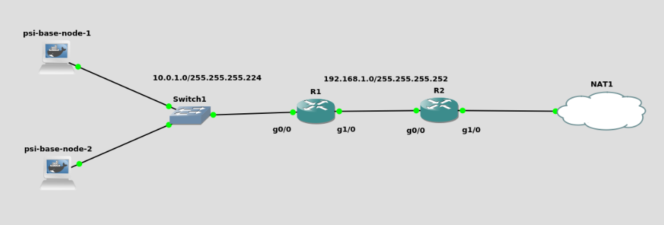

# psi-cv4

## Simple network in GNS3

This is a simple example of a network setup in GNS3. There are 2 Cisco routers with 2 and 30 hosts subnets and 2 end devices. On R2 is set up NAT to access the Internet. The structure can be seen on the picture below

## Build and run

To run the project https://www.gns3.com/ is needed.

## Results

Here are pictures of PCs 1 and 2 accessing the Internet:
